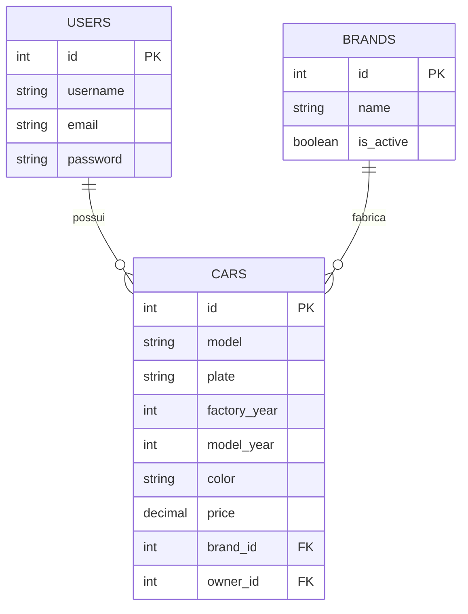
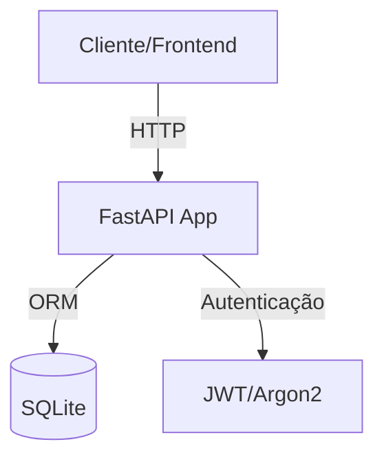
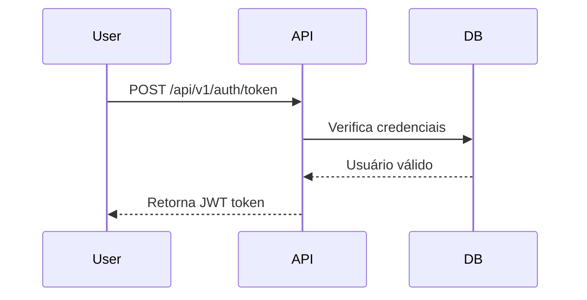
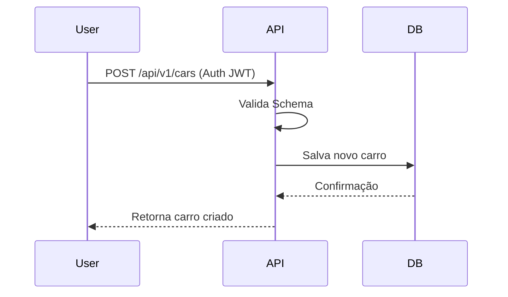

# Modelagem do Sistema

## Modelos de Dados (ERD)

```mermaid
erDiagram
    USERS ||--o{ CARS : "possui"
    BRANDS ||--o{ CARS : "fabrica"
    
    USERS {
        int id PK
        string username
        string email
        string password
    }
    
    BRANDS {
        int id PK
        string name
        boolean is_active
    }
    
    CARS {
        int id PK
        string model
        string plate
        int factory_year
        int model_year
        string color
        decimal price
        int brand_id FK
        int owner_id FK
    }
```

## Arquitetura do Sistema

```mermaid
graph TD
    Client[Cliente/Frontend] -->|HTTP| FastAPI[FastAPI App]
    FastAPI -->|ORM| DB[(SQLite)]
    FastAPI -->|Autenticação| Auth[JWT/Argon2]
```

## Fluxo de Autenticação

```mermaid
sequenceDiagram
    participant User
    participant API
    participant DB
    User->>API: POST /api/v1/auth/token
    API->>DB: Verifica credenciais
    DB-->>API: Usuário válido
    API-->>User: Retorna JWT token
```

## Fluxo CRUD de Carros

```mermaid
sequenceDiagram
    participant User
    participant API
    participant DB
    User->>API: POST /api/v1/cars (Auth JWT)
    API->>API: Valida Schema
    API->>DB: Salva novo carro
    DB-->>API: Confirmação
    API-->>User: Retorna carro criado
```
